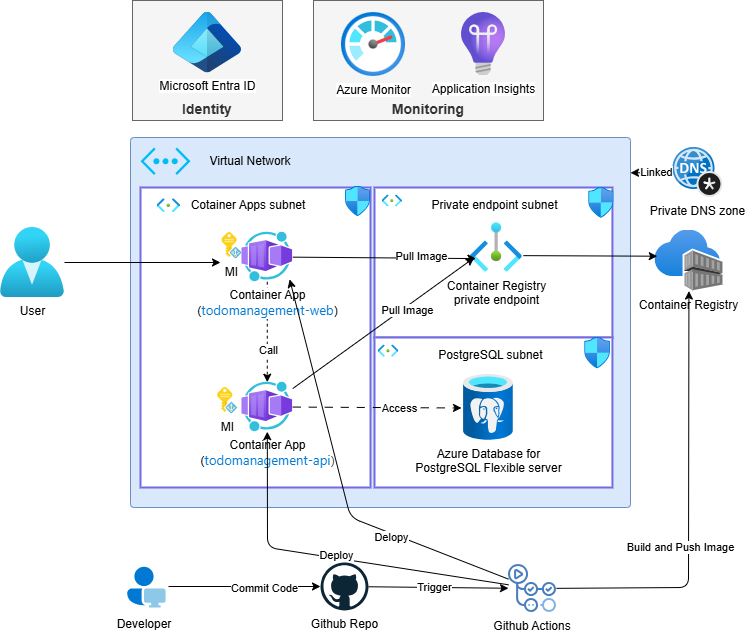

# Todo Management

[English](README.md) | [简体中文](README-zh_CN.md) | [日本語](README-ja_JP.md)

全栈示例：FastAPI + PostgreSQL 后端与 Vue 3 + Vite 前端，使用 Azure Container Apps、ACR、Microsoft Entra ID、用户分配托管标识（UAI）和私网访问实现零明文凭据架构。

## 系统总览

当前基础设施采用**私有化、安全、基于身份**的架构设计，整体实现零硬编码密钥与零明文凭据。




## 架构速览
- 容器：`todomanagement-api`（FastAPI）与 `todomanagement-web`（Vite/Vue）。
- 基础设施：VNet 私有子网、PostgreSQL Flexible Server（Microsoft Entra ID 认证）、ACR 私有端点、Container Apps Environment、Log Analytics、用户分配托管标识（UAI）。
- CI/CD：GitHub Actions 构建镜像推送 ACR，并通过 `az containerapp up` 滚动部署。
- 参考：`docs/ARCHITECTURE_GUIDE-zh_CN.md`。

## 仓库结构
- `src/api`：FastAPI 服务（可 SQLite 本地、PostgreSQL 生产）。
- `src/web`：Vue 3 SPA（MSAL 登录、Todo/搜索功能）。
- `infra`：Bicep 模板、部署脚本、参数文件。
- `docs`：架构与配套说明文档。

## 本地运行
前置：Python 3.11、pip、Node 18+、npm。

API
```powershell
cd src\api
copy .env.local.example .env.local  # 本地可保持 DATABASE_TYPE=sqlite
python -m venv .venv; .\.venv\Scripts\activate
pip install -r requirements.txt
uvicorn main:app --host 0.0.0.0 --port 8000
# 健康检查: http://localhost:8000/health
```
若使用本地 PostgreSQL，设置 `.env.local` 的 `DATABASE_TYPE=postgresql` 及 `POSTGRES_*`。

Web
```powershell
cd src\web
copy .env.example .env.local
npm install
npm run dev  # http://localhost:5173
```
本地开发时，Vite 会把 `/api` 自动反向代理到本地后端。生产构建：`npm run build`，输出在 `dist/`。Azure 生产环境通过 Web Container App 运行时变量 `API_PROXY_TARGET` 将同源 `/api` 反向代理到 internal API Container App。

## 部署
推荐部署顺序如下：
1. 初学者路径 (GUI): `handson/DEPLOY_GUIDE_GUI-zh_CN.md`
2. 进阶路径 (IaC): `handson/DEPLOY_GUIDE-zh_CN.md`

IaC 路径概要：
1. 使用 `infra/deploy.ps1` 部署基础设施
2. 记录 ACR、PostgreSQL 主机名、Container Apps Environment、UAI 标识等输出
3. 由 `.github/workflows/*.yml.template` 初始化工作流文件
4. 配置 GitHub Secret `AZURE_CREDENTIALS` 与所需 Variables
5. 触发 GitHub Actions，并验证 API 与 Web 应用

初学者请先参考 `handson/DEPLOY_GUIDE_GUI-zh_CN.md`。
IaC 进阶请参考 `handson/DEPLOY_GUIDE-zh_CN.md`。

## 相关文档
- `docs/ARCHITECTURE_GUIDE-zh_CN.md`
- `handson/DEPLOY_GUIDE_GUI-zh_CN.md`
- `handson/DEPLOY_GUIDE-zh_CN.md`
- `infra/README.md`
