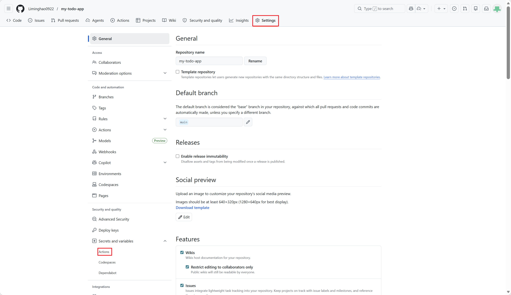
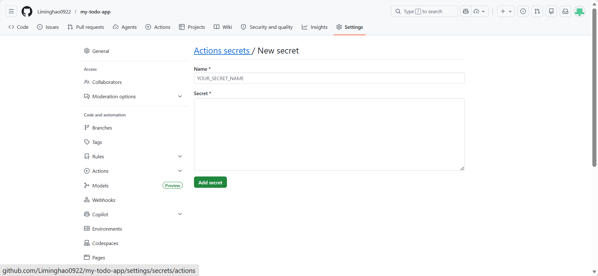
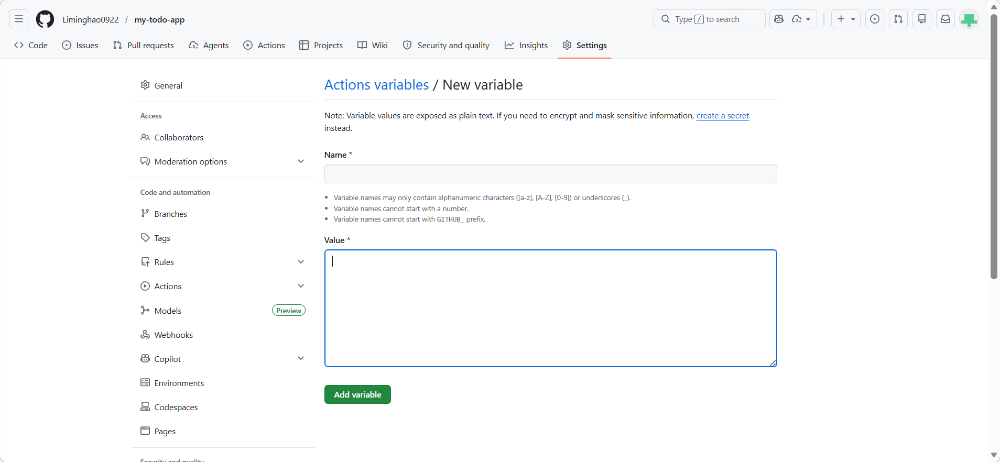

# Todo Management 部署指南

[English](DEPLOY_GUIDE.md) | [简体中文](DEPLOY_GUIDE-zh_CN.md) | [日本語](DEPLOY_GUIDE-ja_JP.md)

本文档用中文说明从 GitHub Template 创建仓库到在 Azure 上完成部署的完整过程。

预计耗时：约 30 到 40 分钟。

---

## 前置条件

- Azure 订阅侧权限：`Owner`，或者 `Contributor` + `User Access Administrator`
- Microsoft Entra ID 中具备创建应用注册的权限
- GitHub 账号
- 已安装 Git
- 可访问互联网

---

## 第 1 步：从 GitHub Template 创建仓库

### 1.1 打开模板仓库

1. 在 GitHub 中打开以下仓库，或者你自己的模板仓库：
	 - URL: `https://github.com/Liminghao0922/todomanagement`

### 1.2 点击 “Use this template”

1. 在仓库页面右上角点击 **Use this template**
2. 选择 **Create a new repository**
3. 填写仓库信息：
	 - **Repository name**：任意名称，例如 `my-todo-app`
	 - **Description**：可选，例如 `My Todo Management App`
	 - **Visibility**：选择 `Public`（本培训流程推荐）
	 - **Include all branches**：不勾选
4. 点击 **Create repository from template**

重要说明：
- 本手册建议参与者使用 `Public` 仓库。
- 如果使用 `Private` 仓库，通常会出现额外的 GitHub 认证与 GitHub Actions 权限配置问题，容易偏离培训主线。

---

## 第 2 步：打开 Azure Cloud Shell（PowerShell）

### 2.1 登录 Azure Portal

1. 打开 `https://portal.azure.com`
2. 使用 Azure 账号登录

### 2.2 启动 Cloud Shell

1. 点击 Azure Portal 顶部的 **Cloud Shell** 图标（`>_`）
2. 等待终端启动
3. 如果默认是 Bash，请切换到 **PowerShell**

### 2.3 确认订阅

```powershell
# 查看当前订阅
az account show

# 如有需要切换订阅
az account set --subscription "<subscription-id>"
```

---

## 第 3 步：在 Cloud Shell 中下载仓库

### 3.1 克隆仓库

```powershell
# 克隆仓库
git clone https://github.com/[your-username]/[your-repo-name].git
cd [your-repo-name]

# 确认目录内容
ls
# 预期看到：
# src/
# infra/
# docs/
# README.md
```

### 3.2 如果你已经在本地提前修改过文件

如果你在进入 Cloud Shell 之前已经在本地做过修改并推送，请同步最新代码：

```powershell
git pull origin main
```

---

## 第 4 步：检查并修改基础设置

### 4.1 在 Cloud Shell 编辑器中检查参数文件

对初学者更友好的方式是使用 Cloud Shell 内置编辑器（VS Code 体验）：

```powershell
# 打开 Cloud Shell 编辑器
code .
```

在编辑器中打开 `infra/parameters.json` 并检查参数。

默认 `infra/parameters.json` 内容如下：

```json
	{
	"$schema": "https://schema.management.azure.com/schemas/2019-04-01/deploymentParameters.json#",
	"contentVersion": "1.0.0.0",
	"parameters": {
		"location": {
			"value": "japaneast"
		},
		"environment": {
			"value": "dev"
		},
		"projectName": {
			"value": "todomanagement"
		},
		"postgresqlVersion": {
			"value": "17"
		},
		"postgresqlAdminUsername": {
			"value": "postgres"
		},
		"postgresqlAdminPassword": {
			"value": "Change@Me123!"
		},
		"vnetAddressPrefix": {
			"value": "10.0.0.0/16"
		},
		"postgresSubnetPrefix": {
			"value": "10.0.1.0/24"
		},
		"containerAppSubnetPrefix": {
			"value": "10.0.2.0/24"
		}
	}
}
```

### 4.2 在编辑器中修改参数

建议在 `infra/parameters.json` 中按需修改：

- `location`：目标区域（例如 `japaneast`）
- `environment`：例如 `handson`
- `projectName`：唯一前缀（例如 `mytodoapp001`）
- `postgresqlAdminPassword`：强密码

如果你更熟悉命令行，也可以继续使用 PowerShell 命令修改。

重点检查这些参数：

| 项目 | 说明 | 示例 |
| --- | --- | --- |
| `location` | Azure 区域 | `japaneast`、`eastus`、`westeurope` |
| `environment` | 环境标识 | `dev`、`staging`、`prod` |
| `projectName` | 资源名前缀 | `myapp`、`mycompany-todo` |
| `postgresqlAdminPassword` | PostgreSQL 管理员密码 | `Str0ng@Password2024!` |

### 4.3 关于 PostgreSQL 密码的说明

- `postgresqlAdminPassword` 只在 PostgreSQL 首次创建时使用。
- 应用运行时访问数据库使用的是用户分配托管标识（UAI）。
- 运行中的应用不会依赖保存的数据库密码。
- 但这个密码本身仍然需要满足强密码要求。

---

## 第 5 步：部署基础设施

### 5.1 设置本地变量

```powershell
# 设置变量
$resourceGroupName = "rg-todomanagement-dev"
$location = "japaneast"
```

### 5.2 运行部署脚本

```powershell
# 进入 infra 目录
cd infra

# 执行 PowerShell 部署脚本
# 如果是在本地 Windows PowerShell，可能需要：
# Set-ExecutionPolicy -ExecutionPolicy RemoteSigned -Scope CurrentUser -Force

.\deploy.ps1 -ResourceGroupName $resourceGroupName -Location $location
```

> 在 Azure Cloud Shell PowerShell 中，通常不需要额外调整执行策略，可直接运行。

### 5.3 记录部署输出

`deploy.ps1` 执行完成后，请记录输出内容。

```powershell
# 输出示例：
==========================================
Infrastructure Details
==========================================
PostgreSQL Server: postgres-todomanagement-4eg3h7exlf4p6
PostgreSQL Hostname: postgres-todomanagement-4eg3h7exlf4p6.postgres.database.azure.com
Container Registry Login Server: acrtodomanagement4eg3h7exlf4p6.azurecr.io
Container Registry Name: acrtodomanagement4eg3h7exlf4p6
Container App Environment: cae-todomanagement-dev
Database Name: tododb
API_URL: https://todomanagement-api.internal.calmhill-4a670c14.japaneast.azurecontainerapps.io
WEB_URL: https://todomanagement-web.calmhill-4a670c14.japaneast.azurecontainerapps.io

Web App Authentication:
	AZURE_CLIENT_ID: xxxxxxxx-1338-4d64-a90c-19ae2cc9eff9
	AZURE_TENANT_ID: xxxxxxxx-b5a9-466f-xxxx-d14b03f7ae76
User Assigned Identity:
	USER_ASSIGNED_IDENTITY_CLIENT_ID: xxxxxxxx-239e-4e1b-b759-5e601fcc4d8a
	USER_ASSIGNED_IDENTITY_RESOURCE_ID: /subscriptions/xxxxxxxx-c1ec-xxxx-9ee7-22103870844b/resourceGroups/rg-todomanagement-xxxxxxxx/providers/Microsoft.ManagedIdentity/userAssignedIdentities/uai-todomanagement-dev
	USER_ASSIGNED_IDENTITY_NAME: uai-todomanagement-dev

==========================================
Next Steps:
	1. Configure GitHub Actions for CI/CD


==========================================
Deployment Completed!
==========================================
```

---

## 第 6 步：为 GitHub Actions 创建 Service Principal 和 Azure 凭据

> 权限说明：
> - 本仓库会在 `infra/main.bicep` 中创建 Microsoft Graph 的 `applications` 资源。
> - 同时还会创建 ACR 的 Azure RBAC 角色分配。
> - 因此 Azure 侧权限至少需要 `Owner`，或者 `Contributor` + `User Access Administrator`。
> - 执行部署的身份还必须可以在 Microsoft Entra ID 中创建应用注册。如果租户关闭了普通用户自助创建应用注册，请使用具备 `Application Administrator`、`Cloud Application Administrator` 或等效目录权限的身份。
> - 如果你的租户中 Bicep 创建应用注册失败，建议改用 Azure CLI 或 Azure Portal GUI 创建应用注册，然后把对应值填入 Variables。

### 6.1 在 Cloud Shell 中创建 Service Principal

执行以下命令：

```powershell
# 设置变量
$subscriptionId = $(az account show --query id -o tsv)
$spName = "github-todomanagement-ci"

# 创建 Service Principal
$sp = az ad sp create-for-rbac `
	--name $spName `
	--role "Owner" `
	--scopes "/subscriptions/$subscriptionId/resourceGroups/$resourceGroupName" `
	--json-auth | ConvertFrom-Json

# 输出 JSON，供后续使用
$sp | ConvertTo-Json
```

### 6.2 保存 JSON 输出

将输出的 JSON 保存下来，供下一步使用：

```json
{
	"clientId": "xxxxxxxx-xxxx-xxxx-xxxx-xxxxxxxxxxxx",
	"clientSecret": "xxxxxxxxxxxxxxxxxxxxxxxxxxxxxxxx",
	"subscriptionId": "xxxxxxxx-xxxx-xxxx-xxxx-xxxxxxxxxxxx",
	"tenantId": "xxxxxxxx-xxxx-xxxx-xxxx-xxxxxxxxxxxx",
	...
}
```

---

## 第 7 步：配置 GitHub Secrets 和 Variables

### 7.1 打开仓库设置

1. 打开你的 GitHub 仓库
2. 点击 **Settings** -> **Secrets and variables** -> **Actions**



### 7.2 添加 Secret

点击 **New repository secret**。

设置：
- **Name**：`AZURE_CREDENTIALS`
- **Value**：粘贴第 6.1 步输出的完整 JSON

```json
{
	"clientId": "...",
	"clientSecret": "...",
	"subscriptionId": "...",
	"tenantId": "...",
	...
}
```

点击 **Add secret**。



### 7.3 添加 Variables

本手册使用 **Repository variables**（不是 environment variables）。

再次进入 **Settings** -> **Secrets and variables** -> **Actions**，并添加以下变量：

| Variable Name | Value | 说明 |
| --- | --- | --- |
| `ACR_NAME` | `acrtodomanagementxxxxx` | 来自部署输出 |
| `RESOURCE_GROUP` | `rg-todomanagement-dev` | 来自部署输出 |
| `CONTAINER_APP_ENVIRONMENT` | `cae-[projectName]-[environment]` | 来自 `Container App Environment` 输出，用于 workflow 的 `--environment` |
| `POSTGRES_SERVER` | `postgres-todomanagement-xxxxx.postgres.database.azure.com` | PostgreSQL 完整域名，来自部署输出 |
| `DATABASE_TYPE` | `postgresql` | 强制 API 使用 PostgreSQL |
| `POSTGRES_DB` | `tododb` | 默认数据库名 |
| `POSTGRES_USER` | `uai-<project>-<env>` | Microsoft Entra ID / UAI 主体名称，不能使用 `postgres` |
| `AZURE_CLIENT_ID` | `[Microsoft Entra ID App ID]` | 从 Azure Portal 获取 |
| `AZURE_TENANT_ID` | `[Tenant ID]` | 从 Azure Portal 获取 |
| `AZURE_REDIRECT_URI` | `https://[web-app-url]` | 部署后获取 |
| `API_PROXY_TARGET` | `https://[api-app-url]` | Web 到 internal API Container App 的反向代理目标 |
| `USER_ASSIGNED_IDENTITY_CLIENT_ID` | `[UAI Client ID]` | 来自部署输出 |
| `USER_ASSIGNED_IDENTITY_RESOURCE_ID` | `/subscriptions/.../userAssignedIdentities/...` | 来自部署输出，供 workflow 的 `--registry-identity` 使用 |

补充说明：

- Web Container App 运行时只需要 `API_PROXY_TARGET`
- `CONTAINER_APP_ENVIRONMENT` 会被 API 和 Web 两个 workflow 用在 `az containerapp up --environment`
- `USER_ASSIGNED_IDENTITY_CLIENT_ID` 用于 API Container App 获取 PostgreSQL 的 Microsoft Entra ID 访问令牌
- `USER_ASSIGNED_IDENTITY_RESOURCE_ID` 仅在 GitHub Actions 部署时使用，不需要注入应用容器内部

添加方式：

1. 打开 **Variables** 标签页
2. 点击 **New repository variable**
3. 在 **Name** 中填写变量名
4. 在 **Value** 中填写变量值
5. 点击 **Add variable**



---

## 第 8 步：复制并启用 GitHub Actions Workflow 文件

### 8.1 复制 workflow 模板文件

在这个模板仓库中，CI/CD workflow 文件使用 `.template` 后缀，这样可以避免模板源仓库自身自动执行 workflow。

请在 Cloud Shell 中执行（位于仓库根目录）：

```bash
# 复制 workflow 文件并去掉 template 后缀
cp .github/workflows/build-deploy-web.yml.template .github/workflows/build-deploy-web.yml
cp .github/workflows/build-deploy-api.yml.template .github/workflows/build-deploy-api.yml

# 检查复制结果
ls -la .github/workflows/

# 预期输出：
# build-deploy-web.yml
# build-deploy-web.yml.template
# build-deploy-api.yml
# build-deploy-api.yml.template
```

Windows PowerShell 版本：

```powershell
Copy-Item ".github/workflows/build-deploy-web.yml.template" ".github/workflows/build-deploy-web.yml"
Copy-Item ".github/workflows/build-deploy-api.yml.template" ".github/workflows/build-deploy-api.yml"

Get-ChildItem ".github/workflows/"
```

### 8.2 为什么使用模板文件

- 避免模板源仓库误触发 workflow
- 让启用 workflow 成为用户的显式操作
- 方便用户在提交前自行修改 workflow

---

## 第 9 步：提交并推送修改

### 9.1 检查本地变更

在本地执行：

```bash
# 检查本地变更
git status

# 示例输出：
# On branch main
# Changes not staged for commit:
#   modified: infra/parameters.json
```

### 9.2 提交并推送

```bash
# 将修改（包括 workflow 文件）加入暂存区
git add .

# 提交
git commit -m "Enable GitHub Actions workflows and configure infrastructure parameters"

# 推送到 main
git push origin main
```

检查结果：

```bash
git log --oneline
```

---

## 第 10 步：运行并检查 GitHub Actions

### 10.1 打开 Actions 页面

1. 打开 GitHub 仓库中的 **Actions** 标签页
2. 确认可以看到以下 workflow：
	 - `Build and Deploy API to ACR`
	 - `Build and Deploy Web to ACR`

### 10.2 等待 workflow 执行完成

触发条件通常包括：

- 向 `main` 分支推送代码
- 修改 `src/api/` 或 `.github/workflows/build-deploy-api.yml` 时触发 API workflow
- 修改 `src/web/` 或 `.github/workflows/build-deploy-web.yml` 时触发 Web workflow

### 10.3 检查执行状态

确认以下步骤成功完成：

- Checkout code
- Log in to Azure
- Build and push image to ACR
- Deploy to Container App

API 和 Web 各自通常需要 5 到 10 分钟。

### 10.4 排查失败运行

常见问题包括：

- `AZURE_CREDENTIALS` 未配置
- `RESOURCE_GROUP` 配置错误
- `CONTAINER_APP_ENVIRONMENT` 与实际部署环境不一致

---

## 第 11 步：访问并验证 Web 应用

### 11.1 获取 Web 应用地址

在 Cloud Shell 中执行：

```powershell
az containerapp show `
	-n todomanagement-web `
	-g $resourceGroupName `
	--query "properties.configuration.ingress.fqdn" `
	-o tsv

# 输出示例：
# todomanagement-web.abc123def.japaneast.azurecontainerapps.io
```

完整 URL：

```
https://todomanagement-web.abc123def.japaneast.azurecontainerapps.io
```

### 11.2 在浏览器中访问

1. 将上述 URL 复制到浏览器地址栏
2. 按 **Enter**
3. 确认 Todo Management 应用成功打开

### 11.3 验证功能

- 点击 **Login** 按钮
- 使用 Microsoft Entra ID 登录
- 确认 Todo 列表正常显示
- 确认可以创建、编辑、删除 Todo

部署完成。

创建时间：2026-04-02
版本：1.0
