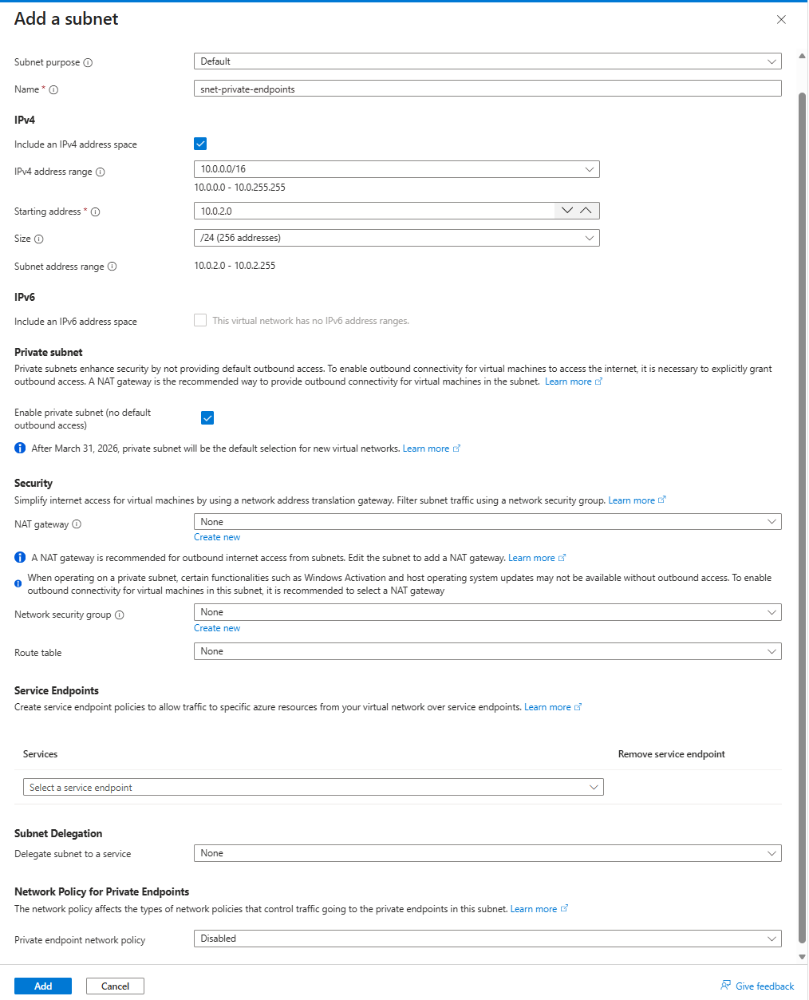
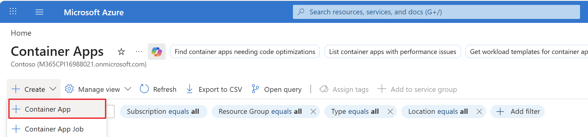
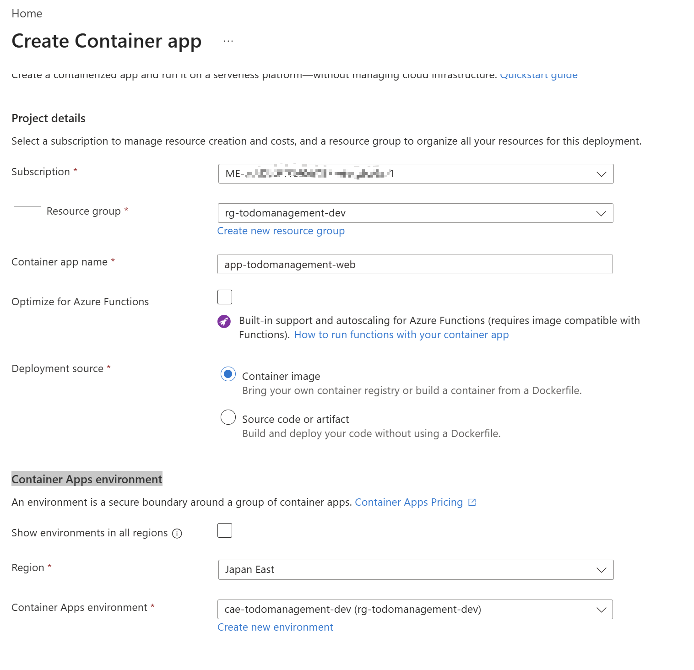
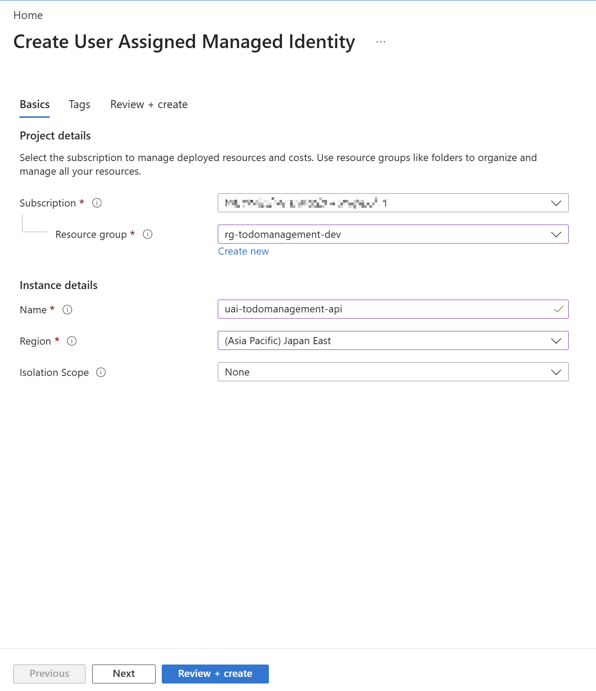
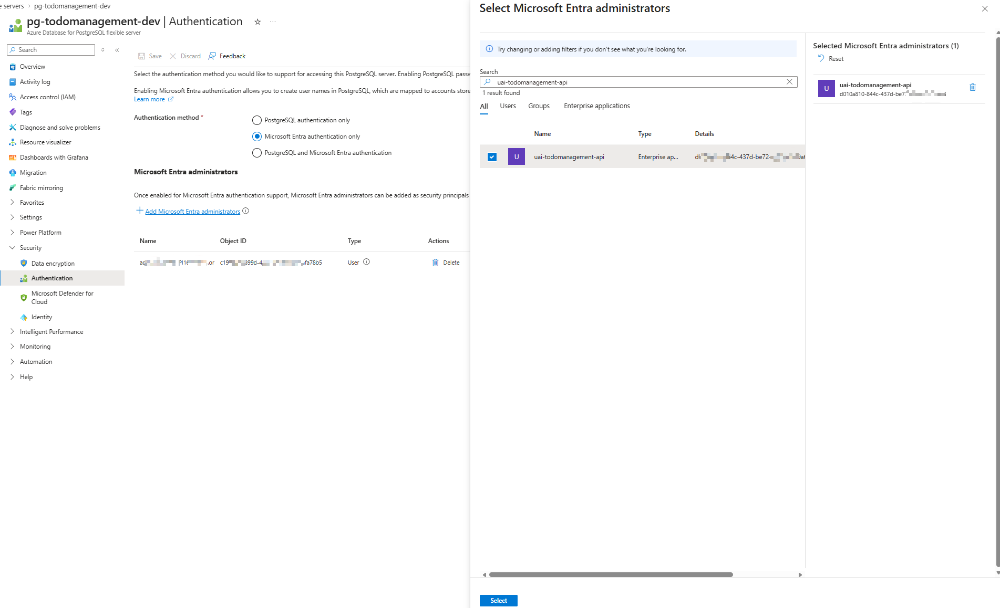
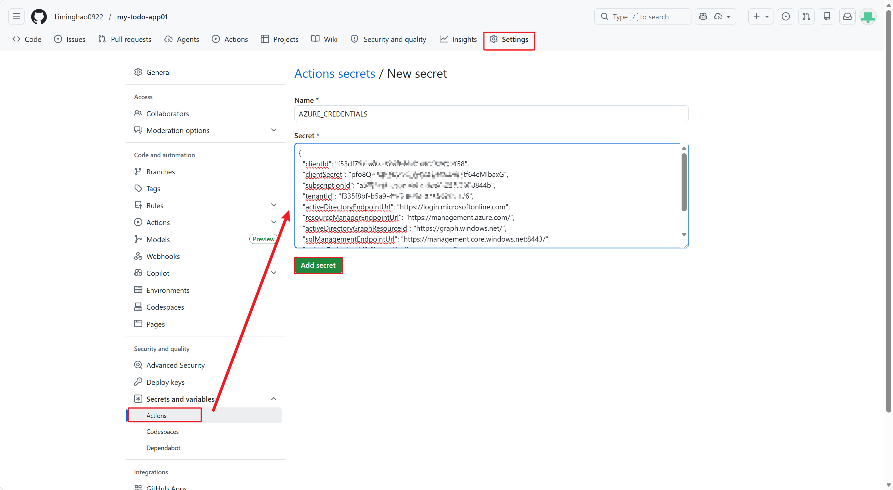

# Todo Management GUI Deployment Guide

[English](DEPLOY_GUIDE_GUI.md) | [简体中文](DEPLOY_GUIDE_GUI-zh_CN.md) | [日本語](DEPLOY_GUIDE_GUI-ja_JP.md)

This guide explains the beginner-friendly, Azure Portal-based (GUI-first) deployment path. Use it for workshops or for your first deployment.

Estimated time: 45 to 60 minutes.

---

## Terminology Standard (EN/JA/ZH)

Use the following terms consistently across all language versions:

- Microsoft Entra ID
- Repository variables
- Azure Container Apps Environment

Notes:

- In this guide, `AZURE_CLIENT_ID` means Microsoft Entra ID application client ID.
- In this guide, `AZURE_TENANT_ID` means Microsoft Entra ID tenant ID.

---

## Workflow Overview

This guide follows these phases:

1. **Phase 1: Azure Infrastructure Setup** (via Portal) - Create all required Azure resources first
2. **Phase 2: Repository Setup** - Create repository from template
3. **Phase 3: GitHub Actions Configuration** - Configure CI/CD, then enable workflows and deploy
4. **Phase 4: Validation** - Test the deployed application

For the IaC/Bicep path, see `DEPLOY_GUIDE.md` (advanced track).

---

## Prerequisites

- Azure subscription permissions: `Owner`, or `Contributor` plus `User Access Administrator`
- Microsoft Entra ID permission to create app registrations:
  - `Application Administrator`, `Cloud Application Administrator`, or `Application Developer` role
  - If your organization allows all users to register applications (default setting), no special role is required
  - Reference: [Least privileged roles by task - Microsoft Entra ID (MS Learn)](https://learn.microsoft.com/entra/identity/role-based-access-control/delegate-by-task)
- GitHub account
- Permission to create a repository from this template

Important for workshop users:

- When creating the repository from the template, use `Public` visibility for this workshop flow
- `Private` repositories require additional GitHub authentication and CI/CD settings that are outside this beginner guide
- Prepare names, region, and required IDs before you start
- Create the Azure infrastructure before creating the repository so you already have the values needed for GitHub Actions

---

## Phase 1: Create Infrastructure from Azure Portal

> Estimated time: 30-40 minutes

Create all Azure resources first. You will need resource IDs and configuration details to configure GitHub Actions later.

> Note: If your Portal display language is Japanese or Chinese, some services may not appear when searched by English names. In that case, search using the localized service name shown in your UI.
> Examples: `Resource groups` / `リソース グループ` / `资源组`, `Virtual networks` / `仮想ネットワーク` / `虚拟网络`, `Container Apps` / `コンテナー アプリ` / `容器应用`

### Architecture Overview

The following diagram shows how all components are deployed in your Azure environment:


**Architecture highlights:**

- User accesses the web application through Container Apps
- Web and API containers run in the same Container Apps Environment within a Virtual Network
- API uses managed identity to securely access PostgreSQL database
- Container Registry stores container images
- All network traffic flows through subnets within the Virtual Network
- Microsoft Entra ID handles user authentication

---

### Resource Creation Order

Create resources in this sequence to ensure proper network configuration:

1. Resource Group
2. Virtual Network and Subnets
3. Azure Container Registry (ACR) with private endpoint
4. Azure Container Apps Environment
5. Azure Database for PostgreSQL Flexible Server
6. User-assigned managed identity (for API)
7. Microsoft Entra ID app registration (for web sign-in)

---

### Step 1.1: Create Resource Group

Reference: [Create resource groups - Azure Portal (MS Learn)](https://learn.microsoft.com/en-us/azure/azure-resource-manager/management/manage-resource-groups-portal#create-resource-groups)

1. Navigate to **Home** > **Resource groups** in Azure Portal
2. Click **Create**
3. On the **Create a resource group** page:
   - **Subscription**: Select your subscription
   - **Resource group**: Enter a name (example: `rg-todomanagement-dev`)
   - **Region**: Select a region (example: `Japan East`)
4. Click **Review + Create** -> **Create**
5. Wait for deployment to complete (usually 1-3 seconds)

> Next: Note down your Resource Group name for later steps

---

### Step 1.2: Create Virtual Network and Subnets

Reference: [Create a virtual network - Azure Portal (MS Learn)](https://learn.microsoft.com/en-us/azure/virtual-network/quick-create-portal)

A Virtual Network provides isolated network space for your resources. Create multiple subnets for different workload types.

1. In Azure Portal, go to **Home** > search for **Virtual networks**
2. Click **Create**
3. On the **Create virtual network** page:

   - **Subscription**: Select your subscription
   - **Resource group**: Select the resource group from Step 1.1
   - **Name**: Enter a name (example: `vnet-todomanagement-dev`)
   - **Region**: Same as resource group (example: `Japan East`)
4. Click **Next**
5. Click **Next** to skip **Security** settings
6. Configure Address Space
   1. Under **IPv4 address space**, set:
      - **Address space**: `10.0.0.0/16` (provides 65,536 IP addresses)

   2. Create Subnets

Click **Add a subnet** and create three subnets:

#### Subnet 1: Container Apps subnet

- **Name**: `snet-container-apps`
- **Subnet address range**: `10.0.1.0/24` (256 addresses)
- **Subnet Delegation**: `Microsoft.App/environments`
- **Other settings**: Leave the defaults
- Click **Add**


#### Subnet 2: Private endpoint subnet

- **Name**: `snet-private-endpoints`
- **Subnet address range**: `10.0.2.0/24` (256 addresses)
- Leave the defaults
- Click **Add**



#### Subnet 3: PostgreSQL subnet

- **Name**: `snet-postgresql`
- **Subnet address range**: `10.0.3.0/24` (256 addresses)
- **Subnet Delegation**: `Microsoft.DBforPostgreSQL/flexibleServers`
- **Other settings**: Leave the defaults
- Click **Add**


7. After adding all three subnets, click **Review + create** -> **Create**
8. Wait for Virtual Network deployment (usually 5-10 seconds)

Next: Note down your VNet name and subnet names
> **Reference your subnets when creating resources:**
> - Container Apps Environment → `snet-container-apps`
> - Private endpoints (ACR, PostgreSQL optional) → `snet-private-endpoints`
> - PostgreSQL Flexible Server → `snet-postgresql`

---

### Step 1.3: Create Azure Container Registry (ACR)

Reference: [Create a container registry - Azure Portal (MS Learn)](https://learn.microsoft.com/en-us/azure/container-registry/container-registry-get-started-portal)

1. In Azure Portal, go to **Home** > search for **Container registries**
2. Click **Create**
3. On the **Create container registry** page:

   - **Subscription**: Select your subscription
   - **Resource group**: Select the resource group from Step 1.1
   - **Registry name**: Enter a unique name (example: `mytodoappacr`)
     - Must be lowercase letters and numbers only
     - Will be used as: `<your-acr-name>.azurecr.io`
   - **Location**: Same as resource group (example: `Japan East`)
   - **Pricing plan**: Select `Premium` (as we will use private endpoint to access the ACR)
   - Leave other settings as default
4. Click **Next: Networking** (to configure private endpoints)
5. On the **Networking** page:

   - **Connectivity**: Select `Private endpoint`
   - Click **Add** to create a private endpoint
   - On the private endpoint creation dialog:
     - **Name**: `pe-acr`
     - **Subnet**: Select `snet-private-endpoints` (from Step 1.2)
     - **Integrate with private DNS zone**: `Yes`
     - Click **OK**
       
6. After private endpoint is configured, click **Review + Create** -> **Create**
7. Wait for ACR deployment (usually 3-5 minutes)

Because public access is disabled, ACR Tasks still need a reachable path to build images. Choose one of the following options:

- **Option A:** Allow selected public access for the `AzureContainerRegistry.<region>` service tag
- **Option B:** Create an agent pool inside your VNet if your region supports ACR agent pools

#### Option A: Enable selected public access

1. Click **Go to resource** to open the ACR resource
2. Click **Networking**

- **Public network access**: select **Selected networks**
- **Address range**: add the IP address ranges for `AzureContainerRegistry.<region>` (example: `AzureContainerRegistry.JapanEast`)
  You can download the latest [Azure IP Ranges and Service Tags - Public Cloud](https://www.microsoft.com/en-us/download/details.aspx?id=56519) file.

  
- Click **Save**

  

#### Option B: Create an agent pool in the VNet

Reference: [Create and manage agent pools in ACR Tasks](https://learn.microsoft.com/en-us/azure/container-registry/tasks-agent-pools)

1. Open Azure Cloud Shell and run the following command

   > Make sure Cloud Shell is set to **PowerShell** (commands in this guide use PowerShell syntax).

   ```powershell
   # Replace with your resource group name from Step 1.1
   $resourceGroupName = "rg-todomanagement-dev"
   # Replace with your virtual network name from Step 1.2
   $vNetName = "vnet-todomanagement-dev"
   $subnetName = "snet-private-endpoints"
   # Replace with your Azure Container Registry name
   $registryName = "mytodoappacr01"
   $agentPoolName = "myagentpool"
   # Get the subnet ID
   $subnetId=$(az network vnet subnet show --resource-group $resourceGroupName --vnet-name $vNetName --name $subnetName --query id --output tsv)
   az acr agentpool create --registry $registryName --name $agentPoolName --tier S1 --subnet-id $subnetId
   ```

**Next: Note down your ACR name (without `.azurecr.io`)**

---

### Step 1.4: Create Azure Container Apps Environment and placeholder container apps

Reference: [Create your first container app with Container Apps - Azure Portal (MS Learn)](https://learn.microsoft.com/en-us/azure/container-apps/quickstart-portal)

Create the API Container App first. This step also creates the Container Apps Environment.

> Recommendation: Keep the Container App names as `app-todomanagement-api` and `app-todomanagement-web`. If you use different names, you must additionally update redirect URLs in Microsoft Entra ID app registration and GitHub Repository variables in later steps.

1. In Azure Portal, go to **Home** > search for **Container Apps**
2. Click **Create** > **Container App**
   
3. On the **Basics** page:

   - **Project details**:
     - **Subscription**: Select your subscription
     - **Resource group**: Select the resource group from Step 1.1
     - **Container app name**: Enter `app-todomanagement-api`
     - Leave other settings as default
       
   - **Container Apps environment**:
     - **Region**: Same as resource group
     - For **Container Apps environment**, click **Create new environment**
       On the **Create Container Apps environment** dialog:
       1. On the **Basics** page:

          - **Environment name**: Enter a name (example: `cae-todomanagement-dev`)
          - Leave other settings as default
       2. On the **Monitoring** page:

          - **Logs Destination**: choose **Azure Log Analytics**
          - **Log Analytics workspace**: click **Create new**
            - **Name**: Enter a name (example: `law-todomanagement-dev`)
            - Click **OK**

          
       3. On the **Networking** page:

          - **Public Network Access**: select **Enabled** because you will validate the application in later steps
          - **Use your own virtual network**: select `Yes`, then specify the virtual network and subnet from Step 1.2
          - Leave other settings as default

          
       4. Click **Create**

          
4. Click **Next: Container**
5. On the **Container** page:

   - **Name**: Enter `app-todomanagement-api`
   - **Image source**: select `Docker Hub or other registries`
   - **Image type**: select `Public`
   - **Registry login server**: enter `mcr.microsoft.com`
   - **Image and tag**: enter `k8se/quickstart:latest`
   - Leave other settings as default


> Note: In this step, you are creating a placeholder Container App. The real image will be deployed later through GitHub Actions.

6. Click **Next: Ingress**
7. On the **Ingress** page:
   - **Ingress**: make sure it is enabled
   - **Target port**: enter `80`
   - Leave other settings as default
     
8. Click **Review + Create** -> **Create**
9. Wait for deployment (usually 4-5 minutes)
10. After the deployment is complete, click **Go to resource** to navigate to the created app.
11. On the **Overview** page, note down the **Application URL** for the API app (example: `https://app-todomanagement-api.internal.politebay-d0fe95ab.japaneast.azurecontainerapps.io`)

Next: Note down your Container Apps Environment name and the API app Application URL

Repeat the same steps to create the web Container App.

1. In Azure Portal, go to **Home** > search for **Container Apps**
2. Click **Create** > **Container App**
   
3. On the **Basics** page:

   - **Project details**:
     - **Subscription**: Select your subscription
     - **Resource group**: Select the resource group from Step 1.1
     - **Container app name**: Enter `app-todomanagement-web`
     - Leave other settings as default
   - **Container Apps environment**:
     - **Region**: Same as resource group (example: `Japan East`)
     - **Container Apps environment**: select the Container Apps environment created in the previous step (example: `cae-todomanagement-dev`)
       
4. Click **Next: Container**
5. On the **Container** page:

   - **Name**: Enter `app-todomanagement-web`
   - **Image source**: select `Docker Hub or other registries`
   - **Image type**: select `Public`
   - **Registry login server**: enter `mcr.microsoft.com`
   - **Image and tag**: enter `k8se/quickstart:latest`
   - **CPU and memory**: select `0.25 CPU cores, 0.5 Gi memory`
   - Leave other settings as default

   > Note: In this step, you are creating a placeholder Container App. The real image will be deployed later through GitHub Actions.
   >
6. Click **Next: Ingress**
7. On the **Ingress** page:

   - **Ingress**: make sure it is enabled
   - **Ingress traffic**: select `Accepting traffic from anywhere`
   - **Target port**: enter `80`
   - Leave other settings as default
     
8. Click **Review + Create** -> **Create**
9. Wait for deployment (usually 1-2 minutes)
10. After the deployment is complete, click **Go to resource** to navigate to the created app.
11. On the **Overview** page, note down the **Application URL** for the web app (example: `https://app-todomanagement-web.politebay-d0fe95ab.japaneast.azurecontainerapps.io`)

Next: Keep the web Application URL for Step 1.8 and Step 3.3

---

### Step 1.5: Create Azure Database for PostgreSQL Flexible Server

Reference: [Create a server - Azure Database for PostgreSQL Flexible Server (MS Learn)](https://learn.microsoft.com/en-us/azure/postgresql/flexible-server/quickstart-create-server-portal)

1. In Azure Portal, go to **Home** > search for **Azure Database for PostgreSQL flexible servers**
2. Click **Create**
3. On the **Create Azure Database for PostgreSQL Flexible Server** page:
   - **Subscription**: Select your subscription
   - **Resource group**: Select the resource group from Step 1.1
   - **Server name**: Enter a name (example: `pg-todomanagement-dev`)
   - **Region**: Same as resource group
   - **PostgreSQL version**: Select `17`
   - **Workload type**: Select `Development`
   - **Compute + storage**: Keep default for development
   - **Authentication method**: Select `Microsoft Entra authentication only`
   - **Microsoft Entra administrator**: Select your user.
     
4. Click **Next: Networking**
5. On the **Networking** page:
   - **Connectivity method**: Select `Private access (VNet Integration)` (recommended for security)
   - **Virtual network**:
     - **Subscription**: Select your subscription
     - **Virtual network**: Select VNet from Step 1.2 (e.g., `vnet-todomanagement-dev`)
     - **Subnet**: Select `snet-postgresql` (from Step 1.2)
   - **Private DNS integration**:
     - **Subscription**: Select your subscription
     - **Private DNS zone**: Select `(New) privatelink.postgres.database.azure.com`. If you already have a private zone with the same name, Azure may show a zone such as `(New) pg-todomanagement-dev.private.postgres.database.azure.com`.
       
6. Click **Review + Create** -> **Create**
7. Wait for deployment (usually 5-10 minutes)

**Next: Note down:**

- PostgreSQL server endpoint (e.g., `pg-todomanagement-dev.postgres.database.azure.com`)

---

### Step 1.6: Create User-Assigned Managed Identity

Reference: [Create a user assigned managed identity - Azure Portal (MS Learn)](https://learn.microsoft.com/en-us/azure/active-directory/managed-identities-azure-resources/how-manage-user-assigned-managed-identities?tabs=azure-portal)

This identity will be used by the API container to access PostgreSQL.

1. In Azure Portal, go to **Home** > search for **Managed Identities**
2. Click **Create**
3. On the **Create User Assigned Managed Identity** page:
   - **Subscription**: Select your subscription
   - **Resource group**: Select the resource group from Step 1.1
   - **Region**: Same as resource group
   - **Name**: Enter a name (example: `uai-todomanagement-api`)
     
4. Click **Review + Create** -> **Create**
5. Wait for deployment (usually 1-5 seconds)
6. Click on the newly created managed identity to open it

**Next: Note down:**  

   - **Client ID** (under Overview)
   - **Resource ID** (under Properties)

---

### Step 1.7: Configure PostgreSQL Database and Permissions

Reference: [Configure server parameters - Azure Database for PostgreSQL (MS Learn)](https://learn.microsoft.com/en-us/azure/postgresql/flexible-server/concepts-server-parameters)

1. In Azure Portal, go to your PostgreSQL server (from Step 1.5)
2. In the left menu, click **Databases**
3. Click **Add**
4. Enter database name: `tododb`
5. Click **Save**
6. Wait for database creation (usually 1-2 minutes)

**Grant Managed Identity Access to PostgreSQL Database:**

1. In Azure Portal, go to your PostgreSQL server
2. In the left menu, click **Security** -> **Authentication**
3. Click **Add Microsoft Entra administrators**. In the **Select Microsoft Entra administrators** dialog, search for the managed identity created in the previous step (example: `uai-todomanagement-api`) and click **Select**
   
4. Click **Save**, and wait for configuration to apply

> Note: Least-privilege database role design is outside the scope of this hands-on guide. For production guidance on creating database users and granting roles to Microsoft Entra principals, see [Manage Microsoft Entra Users - Azure Database for PostgreSQL | Microsoft Learn](https://learn.microsoft.com/en-us/azure/postgresql/security/security-manage-entra-users).

---

### Step 1.8: Create Microsoft Entra ID App Registration

Reference: [Register an application - Microsoft Entra ID (MS Learn)](https://learn.microsoft.com/en-us/azure/active-directory/develop/quickstart-register-app)

This app registration enables web users to sign in with their Microsoft Entra ID account.

1. Open **Microsoft Entra ID** in Azure Portal (or search for it)
2. In the left menu, click **App registrations**
3. Click **New registration**
4. On the **Register an application** page:
   - **Name**: Enter a name (example: `todo-web-app`)
   - **Supported account types**: Select **Accounts in this organizational directory only**
   - **Redirect URI**: Select `Single-page application (SPA)` and enter the **Application URL** of the web Container App you created in Step 1.4 (example: `https://app-todomanagement-web.politebay-d0fe95ab.japaneast.azurecontainerapps.io`)
5. Click **Register**
   
6. The app is now registered. Note down:
   - **Application (client) ID** (Overview page)
   - **Directory (tenant) ID** (Overview page)

---

### Step 1.9: Summary - Collect All Resource Details

Before moving to Phase 2, collect all the following information from your Azure resources:

- **Subscription ID**: `xxxxxxxx-xxxx-xxxx-xxxx-xxxxxxxxxxxx`
- **Resource Group**: `rg-todomanagement-dev`
- **Virtual Network**: `vnet-todomanagement-dev`
- **Container Apps Subnet**: `snet-container-apps`
- **Private Endpoints Subnet**: `snet-private-endpoints`
- **PostgreSQL Subnet**: `snet-postgresql`
- **ACR Name**: `mytodoappacr`
- **Container Apps Environment**: `cae-todomanagement-dev`
- **PostgreSQL Server**: `pg-todomanagement-dev.postgres.database.azure.com`
- **PostgreSQL Database**: `tododb`
- **Managed Identity Name**: `uai-todomanagement-api`
- **Managed Identity Client ID**: `xxxxxxxx-xxxx-xxxx-xxxx-xxxxxxxxxxxx`
- **Managed Identity Resource ID**: `/subscriptions/.../resourceGroups/.../providers/Microsoft.ManagedIdentity/userAssignedIdentities/uai-todomanagement-api`
- **Entra ID App Client ID**: `xxxxxxxx-xxxx-xxxx-xxxx-xxxxxxxxxxxx`
- **Entra ID App Tenant ID**: `xxxxxxxx-xxxx-xxxx-xxxx-xxxxxxxxxxxx`
- **Web Container App URL**: `https://app-todomanagement-web.<region>.azurecontainerapps.io`
- **API Container App URL**: `https://app-todomanagement-api.internal.<region>.azurecontainerapps.io`

---

## Phase 2: Create Repository

> Estimated time: 5-10 minutes

Now that your Azure infrastructure is ready, create your GitHub repository.

### Step 2.1: Create your repository from template

Reference: [Creating a repository from a template (GitHub Docs)](https://docs.github.com/en/repositories/creating-and-managing-repositories/creating-a-repository-from-a-template)

1. Open the template repository
2. Click **Use this template** -> **Create a new repository**
3. Set:
   - **Repository name**: for example `my-todo-app`
   - **Visibility**: `Public` (recommended for this workshop flow)
4. Click **Create repository from template**
5. Wait for the repository to be created

---

## Phase 3: Configure GitHub Actions and Deploy

> Estimated time: 15-20 minutes

Configure GitHub Actions with your Azure credentials and resource details first, then enable workflow files to avoid empty/failed initial runs.

### Step 3.1: Create Azure Service Principal and Credentials

Reference: [Create an Azure service principal (MS Learn)](https://learn.microsoft.com/en-us/azure/developer/github/publish-docker-container)

1. Open **Azure Cloud Shell** in Azure Portal
2. Run this command to create a service principal scoped to your resource group:

   ```powershell
   # Check current subscription
   az account show

   # Switch to a different subscription (if needed)
   # Replace `<subscription-id>` with your subscription ID from Phase 1 summary (Step 1.9).
   az account set --subscription "<subscription-id>"

   # Set variables
   $subscriptionId = $(az account show --query id -o tsv)
   $spName = "github-todomanagement-ci"
   # Replace with your resource group name from Phase 1 summary (Step 1.9) if you changed it.
   $resourceGroupName = "rg-todomanagement-dev"
   # Create service principal
   $sp = az ad sp create-for-rbac `
   --name $spName `
   --role "Owner" `
   --scopes "/subscriptions/$subscriptionId/resourceGroups/$resourceGroupName" `
   --json-auth | ConvertFrom-Json

   # Output as JSON (for later use)
   $sp | ConvertTo-Json
   ```

3. Copy the JSON output (the entire `{...}` block)

**Note:** This JSON output is sensitive. Keep it secure.

---

### Step 3.2: Add GitHub Actions Secret

1. In your GitHub repository, go to **Settings**
2. In the left menu, click **Secrets and variables** > **Actions**
3. Click **New repository secret**
4. **Name**: `AZURE_CREDENTIALS`
5. **Secret**: Paste the JSON output from Step 3.1
6. Click **Add secret**
   

---

### Step 3.3: Add GitHub Repository Variables

Reference: [Using variables in GitHub Actions (GitHub Docs)](https://docs.github.com/en/actions/learn-github-actions/variables)

In your GitHub repository **Settings** > **Secrets and variables** > **Actions**, click **Variables**, and add these repository variables:


| Variable                             | Value                                    | Reference     |
| ------------------------------------ | ---------------------------------------- | ------------- |
| `RESOURCE_GROUP`                     | Your resource group name                 | From Step 1.9 |
| `ACR_NAME`                           | Your ACR name (without`.azurecr.io`)     | From Step 1.9 |
| `CONTAINER_APP_ENVIRONMENT`          | Your Container Apps Environment name     | From Step 1.9 |
| `POSTGRES_SERVER`                    | Your PostgreSQL server FQDN              | From Step 1.9 |
| `POSTGRES_USER`                      | Your user-assigned managed identity name | From Step 1.9 |
| `POSTGRES_DB`                        | `tododb`                                 | Fixed value   |
| `DATABASE_TYPE`                      | `postgresql`                             | Fixed value   |
| `AZURE_CLIENT_ID`                    | Entra ID App Client ID                   | From Step 1.9 |
| `AZURE_TENANT_ID`                    | Entra ID App Tenant ID                   | From Step 1.9 |
| `USER_ASSIGNED_IDENTITY_CLIENT_ID`   | Managed Identity Client ID               | From Step 1.9 |
| `USER_ASSIGNED_IDENTITY_RESOURCE_ID` | Managed Identity Resource ID             | From Step 1.9 |
| `AZURE_REDIRECT_URI`                 | Your web Container App URL               | From Step 1.9 |
| `API_PROXY_TARGET`                   | Your internal API Container App URL      | From Step 1.9 |
| `REPOSITORY`                         | Your repository URL                      | From Step 2.1 |

---

### Step 3.4: Prepare workflow files

Reference: [GitHub Actions documentation](https://docs.github.com/en/actions)

After secrets and variables are configured, enable workflow files.

In your repository, CI/CD workflow files are provided as templates:

- `.github/workflows/build-deploy-api.yml.template` → rename to `build-deploy-api.yml`
- `.github/workflows/build-deploy-web.yml.template` → rename to `build-deploy-web.yml`

To create the files:

1. Open **Azure Cloud Shell** in Azure Portal
2. Run this command:

```powershell
git clone <your-repo-url>
cd my-todo-app

# Copy templates without .template extension
cp .github/workflows/build-deploy-api.yml.template .github/workflows/build-deploy-api.yml
cp .github/workflows/build-deploy-web.yml.template .github/workflows/build-deploy-web.yml

# Commit and push
git add .github/workflows/*.yml
git commit -m "Enable API and Web build-deploy workflows"
git push origin main
```

---

### Step 3.5: Run GitHub Actions Workflows

1. In your repository, go to the **Actions** tab
2. You should see both workflows listed:
   - `Build and Deploy API to ACR`
   - `Build and Deploy Web to ACR`
3. If workflows don't show, ensure:
   - `.github/workflows/build-deploy-api.yml` and `.github/workflows/build-deploy-web.yml` are committed to `main`
4. The workflows should trigger automatically on `main` branch commits
5. Click on each workflow and monitor:
   - Check for any **red X** (failures) or **green checkmark** (success)
   - Both should complete within 5-10 minutes each

**Troubleshooting workflow failures:**

- Check **AZURE_CREDENTIALS** is valid JSON
- Ensure all variables are filled
- Check that Azure resources exist and names match exactly

---

## Phase 4: Validate Deployment

> Estimated time: 10 minutes

### Step 4.1: Verify Container App Deployments

1. In Azure Portal, go to your **Container Apps Environment**
2. You should see two container apps:
   - `app-todomanagement-api`
   - `app-todomanagement-web`
3. Click `app-todomanagement-web` and note down the web app **URL**
4. Click `app-todomanagement-api` and note down the internal API **URL**

---

### Step 4.2: Verify the Entra ID Redirect URI

The redirect URI should already match the web Container App URL you registered in Step 1.8. Verify it here and update it only if needed.

1. Go to your **Entra ID App registration** (from Step 1.8)
2. Click **Authentication**
3. Confirm that the SPA redirect URI matches your web Container App URL from Step 4.1
4. If you need to add or update it, use `https://<your-web-url>`
   - Replace `<your-web-url>` with the web app URL from Step 4.1
   - Do not append `/callback`
5. Check **Access tokens** and **ID tokens** checkboxes
6. Click **Save**

---

### Step 4.3: Verify GitHub Variables for Web and API URLs

Go back to your repository **Settings** > **Secrets and variables** > **Actions**:

1. Click **Variables**
2. Find `AZURE_REDIRECT_URI` and click **Edit**
   - Confirm the value is `https://<your-web-url>`
   - Click **Update variable**
3. Find `API_PROXY_TARGET` and click **Edit**
   - Confirm the value is the internal API URL from Step 4.1: `https://<your-api-url>`
   - Click **Update variable**

If these values already match what you set in Step 3.3, no change is needed.

---

### Step 4.4: Test the Application

1. Open the web application URL in your browser
2. Click **Login**
3. Sign in with your Microsoft Entra ID credentials
4. Once logged in, you should see a **Todo List** page
5. Test the functionality:
   - **Create**: Add a new todo item, click Save
   - **Edit**: Click on a todo item to edit it
   - **Delete**: Click the delete button to remove a todo item
   - **Refresh**: All changes should persist after page refresh

**If login fails:**

- Check Entra ID redirect URI is correct
- Check `AZURE_CLIENT_ID` and `AZURE_TENANT_ID` are correct
- Check browser console for error details (F12 > Console)

**If API fails to respond:**

- Check PostgreSQL database is accessible
- Check managed identity has database permissions
- Check API container logs in Container Apps

---

## Summary of Completion

Your Todo Management application is now deployed on Azure.

**What was deployed:**

- ✅ PostgreSQL database with todo schema
- ✅ API container in Azure Container Apps
- ✅ Web container in Azure Container Apps
- ✅ User authentication via Microsoft Entra ID
- ✅ CI/CD pipeline via GitHub Actions

**Next steps:**

- Monitor application in Azure Application Insights
- Learn the IaC approach in `DEPLOY_GUIDE.md`
- Customize the application for your organization

---

## Common Issues and Troubleshooting

### Workflow cannot login to Azure

**Error**: `Error: Unable to login with service principal`

**Solution:**

- Verify `AZURE_CREDENTIALS` secret contains valid JSON from `az ad sp create-for-rbac --json-auth`
- Check JSON is not truncated or corrupted
- Re-create service principal if needed: `az ad sp create-for-rbac --name "github-actions-todoapp" --role Contributor --scopes /subscriptions/<SUBSCRIPTION_ID> --json-auth`

### API cannot connect to PostgreSQL

**Error**: `could not translate host name "pg-..." to address`

**Solution:**

- Check `POSTGRES_SERVER` variable matches your PostgreSQL server hostname exactly
- Verify the PostgreSQL server is connected to the correct VNet, subnet, and private DNS zone
- Verify the managed identity has the expected database permissions
- Check that `POSTGRES_USER` is set to the managed identity name, not `postgres`

### Web login fails or shows error

**Error**: `AADSTS50058: Silent sign-in request failed`

**Solution:**

- Verify `AZURE_CLIENT_ID` and `AZURE_TENANT_ID` are correct
- Check `AZURE_REDIRECT_URI` matches the exact URL registered in Entra ID (Step 4.2)
- Ensure redirect URI in Entra ID has `https://` scheme
- Check access tokens and ID tokens are enabled in Entra ID (Step 4.2)

### Container Apps shows no deployments

**Error**: You don't see `app-todomanagement-api` or `app-todomanagement-web` in the Container Apps Environment

**Solution:**

- Check GitHub Actions workflows completed successfully (no red X)
- Check ACR has new images: go to Container Registry > Repositories
- If no images, workflows may have failed - check workflow logs for errors
- Verify `ACR_NAME`, `RESOURCE_GROUP` match exactly with no spaces

---

## Next Steps

- **Beginner path complete:** Your application is ready to use!
- **Advanced path:** Learn Infrastructure as Code in `DEPLOY_GUIDE.md`
